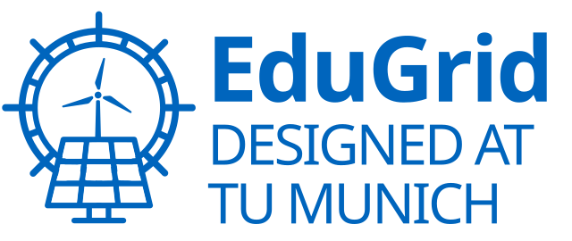
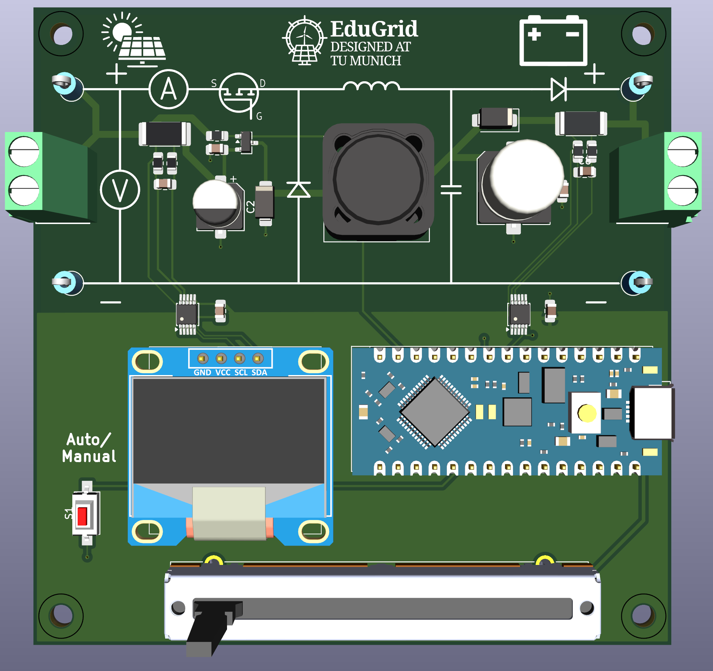

<p align="center">
  
</p>

<h1 align="center">EduGrid MPPT</h1>

<p align="center">
  <strong>Learn solar energy by trying it.</strong><br>
  A friendly, open-source learning kit for renewable energy education.
</p>

<p align="center">
  
  &nbsp;&nbsp;
  
</p>

EduGrid MPPT is part of the EduGrid e.V initiative for free education in renewable energies. It is made for students, teachers, workshops, and curious people who want to understand solar power with their own hands.

You do not need to be an expert to begin. Start by moving the slider, watching the display, and seeing how much power a small solar panel can produce. Later, when you feel ready, you can open the code and teach the board your own strategy for finding more power.



## What You Can Discover

- How sunlight becomes electrical power.
- Why a solar panel has a "best point" where it gives the most energy.
- How a small controller can search for that point automatically.
- How coding, electronics, and renewable energy connect in one real project.

This is not just a board and some code. It is a small learning environment: measure something real, ask why it happens, change one thing, and try again.

## Choose Your Path

| I want to... | Start here |
| --- | --- |
| learn the project step by step | [Student Workbook](docs/STUDENT_WORKBOOK.md) |
| upload the firmware to the board | [Firmware Instructions](firmware/README.md) |
| look at the circuit and PCB | [Hardware Files](hardware/README.md) |
| explore the web dashboard | [Dashboard Source](frontend/README.md) |

## ESP32 web pages

When connected to the board's open `EduGrid_XX` WiFi network, open
`http://192.168.4.1/` for the dashboard. In the real experiment view,
select **Downloads** in the header to find recorded CSV files. The
`/downloads` page can also be opened directly.

`http://192.168.4.1/admin` is the firmware and filesystem update page.
Neither page requires a password. Anyone connected to the open EduGrid WiFi
can update the board or delete recordings; use it in a supervised setting.
See the [firmware instructions](firmware/README.md) for the update workflow.

## For Students

Begin with the workbook and the manual experiments. Your first goal is simple: find the duty setting where the solar panel produces the most power.

When you are ready to code, your workspace is:

```text
firmware/src/mppt_alg.cpp
```

Small changes are welcome. Good experiments often begin with "What happens if I try this?"

## For Teachers

EduGrid MPPT is designed for gentle entry and deeper follow-up. A first lesson can stay fully practical: connect the board, change the operating point, and discuss power. Later lessons can introduce algorithms, sensor data, dashboards, and the structure of embedded software.

The [Student Workbook](docs/STUDENT_WORKBOOK.md) is written so it can be used in class or exported as a PDF for home study.

## The Bigger Picture

EduGrid e.V works to make renewable energy education freely available. This project supports that mission with open learning material, open hardware files, and firmware that students can actually read and change.

Renewable energy becomes less mysterious when learners can touch it, measure it, and improve it. That is the spirit of EduGrid MPPT.

## License

Hardware, firmware, and documentation are each released under different open licenses. See [LICENSE.md](LICENSE.md) for details.
