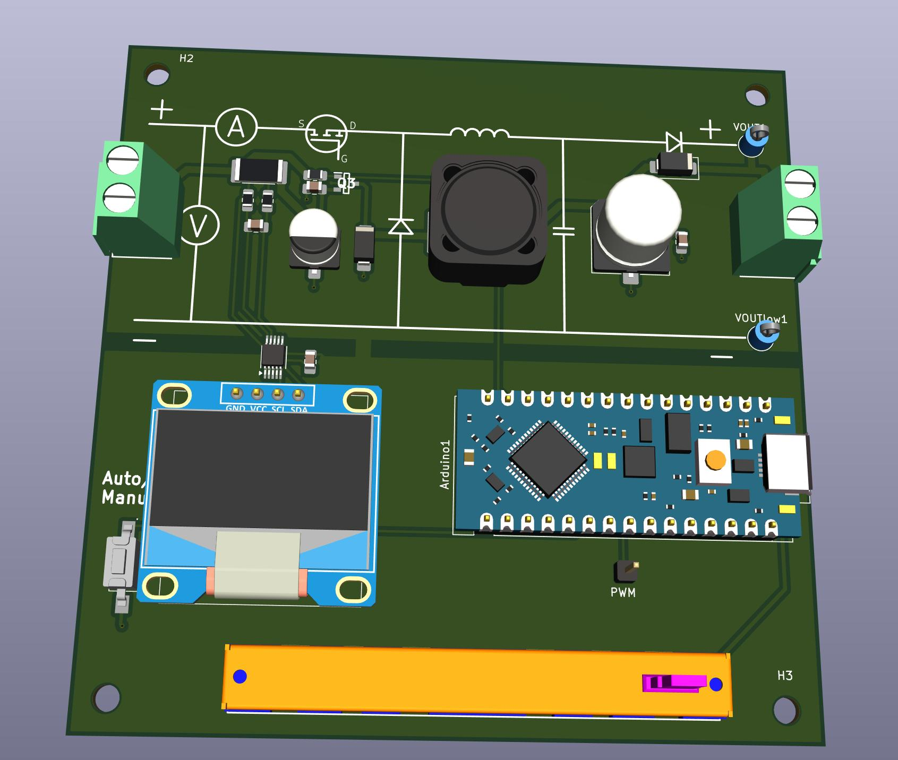

# EduGrid MPPT ☀️🔋



**EduGrid MPPT** is an open-source, educational Maximum Power Point Tracking (MPPT) platform designed to help students and hobbyists understand solar energy conversion. From simple PWM control to advanced adaptive algorithms, this board allows you to tinker, experiment, and visualize the physics of photovoltaics.

## 🚀 Features

*   **Dual Architecture Support**: Runs on **Arduino Nano** (AVR) for simplicity or **ESP32** for advanced IoT features.
*   **Real-Time Web Dashboard** (ESP32):
    *   Monitor Voltage, Current, Power, and Duty Cycle via WiFi.
    *   **Live IV Curve Tracing**: Visualize the characteristics of your solar panel.
    *   **MPPT History**: Watch the algorithm "climb the hill" in real-time on the graph.
*   **Multiple Algorithms**:
    *   Perturb & Observe (P&O)
    *   Incremental Conductance (IncCond)
    *   Manual Duty Cycle Control
*   **Hardware Abstraction**: Modular C++ design makes it easy to swap sensors or displays.
*   **OLED Display**: On-board SH1106 display for standalone telemetry.

## 🛠️ Hardware Specifications

*   **Microcontroller**: Socket for Arduino Nano (ATmega328P) or ESP32 DevKit V1.
*   **Power Stage**: Synchronous Buck Converter (Software controlled).
*   **Sensing**: INA226 High-Side Current & Voltage Sensor (I2C).
*   **Display**: 1.3" SH1106 OLED (I2C).
*   **Inputs**:
    *   Rotary Potentiometer (Manual Control).
    *   Push Button (Mode/Algorithm Switching).

## 📦 Getting Started

This project is built with **PlatformIO**.

### Prerequisites
*   VS Code with PlatformIO Extension.
*   EduGrid MPPT Hardware.

### Installation

1.  **Clone the repository**:
    ```bash
    git clone https://gitlab.com/your-username/edugrid-mppt.git
    cd edugrid-mppt
    ```

2.  **Select your Environment**:
    *   **ESP32**: Advanced features (WiFi, Web Dashboard).
    *   **Nano**: Basic standalone operation.

3.  **Build & Upload**:
    *   Open the PlatformIO sidebar.
    *   Select `env:esp32dev` or `env:nanoatmega328new`.
    *   Click **Upload**.

4.  **Upload Filesystem (ESP32 Only)**:
    *   To enable the web dashboard, you must upload the HTML files.
    *   PlatformIO Sidebar -> `esp32dev` -> Platform -> **Upload Filesystem Image**.

## 🌐 Web Dashboard (ESP32)

When running on ESP32, the board creates a WiFi Access Point:

*   **SSID**: `EduGrid_MPPT`
*   **Password**: *None (Open Network)*
*   **IP Address**: `192.168.4.1`

Navigate to `http://192.168.4.1` on your phone or laptop to:
*   View real-time power stats.
*   Switch between **Auto** and **Manual** modes.
*   Change MPPT algorithms on the fly.
*   **Start IV Sweep**: Pauses MPPT to scan the panel's voltage range and plot the Power/Voltage curves.

## 🕹️ Controls

| Input | Action |
| :--- | :--- |
| **Button (Short Press)** | Toggle **Auto / Manual** Mode |
| **Button (Long Press)** | Switch Algorithm (**P&O / IncCond**) |
| **Potentiometer** | Adjust Duty Cycle (in Manual Mode) |

## 📚 Educational Goals

1.  **Basics**: Use Manual Mode to understand the relationship between Duty Cycle and Panel Voltage.
2.  **Algorithms**: Compare P&O vs. IncCond response times under changing light conditions.
3.  **Characterization**: Use the IV Sweep to see how shading affects the Power Curve.

## 📄 License

This project is open-source. Feel free to modify and use it for educational purposes.
