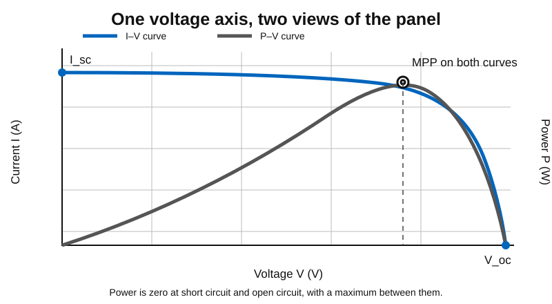
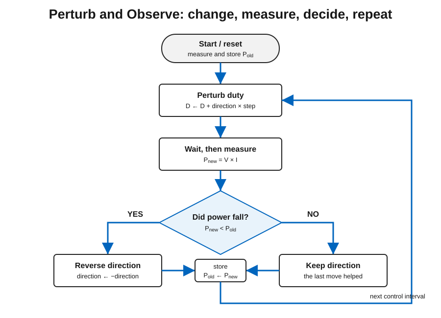
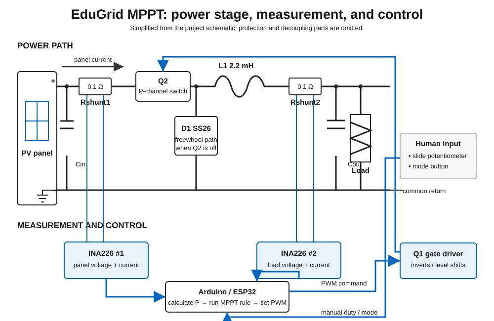
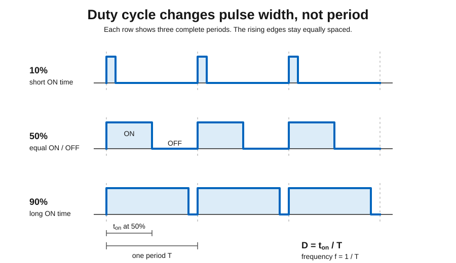
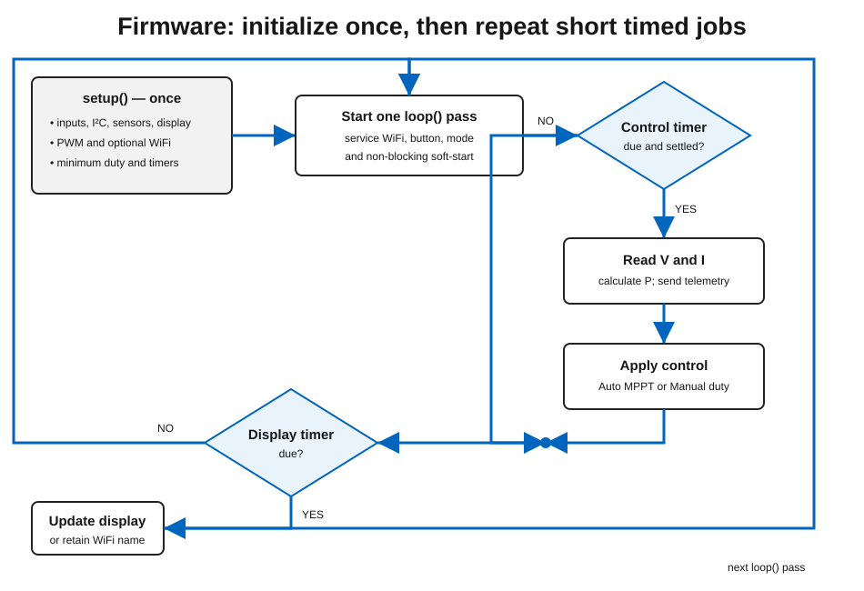

# EduGrid MPPT Student Workbook

This workbook introduces the EduGrid MPPT project to students who are new to coding and Maximum Power Point Tracking. It is designed for supervised classroom work, but the reference appendices also support independent preparation.

The learning path is deliberately practical:

> **Find a maximum by hand → lose it → invent a rule → test the rule → only then meet the named algorithm.**

The main student coding file is:

```text
firmware/src/mppt_alg.cpp
```

The rest of the firmware reads sensors, drives the converter, updates the display, and serves the optional Nano ESP32 dashboard.

## Contents

1. [Before You Start](#1-before-you-start)
2. [What A Solar Panel Does](#2-what-a-solar-panel-does)
3. [Experiment 1: Find The Maximum By Hand](#3-experiment-1-find-the-maximum-by-hand)
4. [Experiment 2: Lose It And Get It Back](#4-experiment-2-lose-it-and-get-it-back)
5. [Experiment 3: Write Down Your Rule](#5-experiment-3-write-down-your-rule)
6. [Experiment 4: Trade Rules With Another Group](#6-experiment-4-trade-rules-with-another-group)
7. [What You Invented Is Called Perturb And Observe](#7-what-you-invented-is-called-perturb-and-observe)
8. [Experiment 5: Put Your Rule Into The Code](#8-experiment-5-put-your-rule-into-the-code)
9. [Experiment 6: Change The Step Size](#9-experiment-6-change-the-step-size)
10. [A Second Idea: Incremental Conductance](#10-a-second-idea-incremental-conductance)
11. [Experiment 7: Compare The Two Algorithms](#11-experiment-7-compare-the-two-algorithms)
12. [Experiment 8: Use The Dashboard And The Sweep](#12-experiment-8-use-the-dashboard-and-the-sweep)
13. [How The Board Works](#13-how-the-board-works)
14. [Experiment 9: Trace One Measurement Through The Code](#14-experiment-9-trace-one-measurement-through-the-code)
15. [Reference Appendices](#appendix-a-c-you-will-meet-in-this-project)

---

## 1. Before You Start

### How to use this workbook

1. Begin with Experiment 1 rather than reading every appendix.
2. Make a prediction before moving a control.
3. Record what the display actually shows, including values that are not round.
4. Change one thing at a time whenever possible.
5. Keep failures visible. A rule that oscillates or gets stuck is useful evidence.
6. Follow links to the appendices only when an experiment needs them.

Teacher pacing idea:

| Lesson | Main goal | Activity |
| --- | --- | --- |
| 1 | Voltage, current, power, and what a panel does | Experiments 1 and 2 |
| 2 | Invent a tracking rule | Experiments 3 and 4, then Section 7 |
| 3 | Basic C++ for this project | Appendix A, then Experiment 5 |
| 4 | Make the rule work well | Experiment 6 |
| 5 | Compare two algorithms | Section 10 and Experiment 7 |
| 6 | See the whole system | Experiments 8 and 9 |

### What you need

- An EduGrid MPPT board with the correct firmware for its microcontroller.
- A small PV module and a teacher-approved light source.
- A suitable resistive load connected to the converter output.
- USB power/programming cable and a computer with PlatformIO.
- A notebook or this printed workbook.
- For Experiment 8: an Arduino Nano ESP32 or ESP32-C3 build and a phone or laptop with WiFi.

### Safety notes

- Do not exceed the voltage, current, temperature, or component limits given by the teacher.
- Shorting the **panel** is safe: a solar panel limits its own current, and the short-circuit current `I_sc` is one of the numbers on its datasheet. Shorting the **converter output** is not safe: the output capacitor can deliver a large current for a short time. Do not short the output.
- De-energize the setup before changing wiring.
- A lamp, load resistor, diode, inductor, and MOSFET can become hot. Stop if a component heats unexpectedly.
- If measurements look strange, stop changing code and check wiring first.
- MPPT code can move the converter operating point quickly. Begin with small duty-cycle steps.

---

## 2. What A Solar Panel Does

A solar panel is not an ideal battery. Its voltage and current depend on illumination, temperature, and the electrical load.

Three quantities matter throughout the workbook:

| Quantity | Symbol | Unit | Meaning |
| --- | --- | --- | --- |
| Voltage | `V` | volts (V) | Electrical potential difference |
| Current | `I` | amperes (A) | Flow of charge |
| Power | `P` | watts (W) | Energy transferred per second |

The key equation is:

```text
Power = Voltage × Current
P = V × I
```

For example:

```text
5.0 V × 0.12 A = 0.60 W
```



The current–voltage plot is called an **I–V curve**. The power–voltage plot is called a **P–V curve**. Both share voltage on the horizontal axis.

- At short circuit, voltage is near zero. Current can be high, but `P = V × I` is zero.
- At open circuit, current is zero. Voltage can be high, but power is again zero.
- Between those endpoints, the product `V × I` has a maximum.

That peak is the **maximum power point**, or MPP. Its voltage, current, and power are often written as `V_mpp`, `I_mpp`, and `P_mpp`. The best point moves when light, shade, or temperature changes.

---

## 3. Experiment 1: Find The Maximum By Hand

**Goal:** discover the panel's power peak before writing an algorithm.

### Predict

The slider changes how strongly the converter loads the panel. Before touching it, predict:

- Which end will leave the panel close to open circuit?
- As duty cycle increases, will panel voltage rise or fall?
- Will maximum power occur at an end or somewhere in between?

Write your prediction:

```text


```

If you want the mechanism before testing your prediction, see [Section 13.4](#134-how-the-slider-moves-the-operating-point). Otherwise, test first and return to the explanation later.

### Steps

1. Upload the firmware and connect the teacher-approved panel and load.
2. Use a short button press to select **Manual** mode.
3. Move the slider a little at a time, from one end to the other.
4. At each stop, write down the duty cycle shown on the display — whatever it happens to be — together with voltage, current, and power.
5. Aim for about nine readings spread across the whole travel.
6. Plot power against duty cycle and mark the highest measured point.

| Reading | Duty shown | Panel voltage (V) | Panel current (A) | Panel power (W) | Observation |
| ---: | ---: | ---: | ---: | ---: | --- |
| 1 | | | | | |
| 2 | | | | | |
| 3 | | | | | |
| 4 | | | | | |
| 5 | | | | | |
| 6 | | | | | |
| 7 | | | | | |
| 8 | | | | | |
| 9 | | | | | |

### Questions

1. At which measured duty cycle was power highest?
2. What happened to panel voltage as duty cycle increased?
3. Was the curve smooth or noisy?
4. Did the best duty cycle stay at one of the ends?
5. Write one sentence describing how you would find the best duty cycle again if the light changed.

```text
My first tracking rule:

```

---

## 4. Experiment 2: Lose It And Get It Back

**Goal:** recover maximum power after the environment moves it, without sweeping the entire slider again.

### Steps

1. Return to the best duty setting you found in Experiment 1.
2. Record the starting voltage, current, power, and duty.
3. Change the light in one teacher-approved way: move the lamp farther away, or let a hand or card cast a partial shadow.
4. Do **not** sweep the slider from end to end.
5. Use only the numbers on the display to decide which way to move.
6. Count each slider move until you believe you have found the new maximum.
7. Confirm with a few small moves on either side.

| Stage | Duty shown | Voltage (V) | Current (A) | Power (W) | Move made |
| --- | ---: | ---: | ---: | ---: | --- |
| Before light change | | | | | — |
| Immediately after change | | | | | — |
| Move 1 | | | | | |
| Move 2 | | | | | |
| Move 3 | | | | | |
| Move 4 | | | | | |
| Best recovered point | | | | | |

Number of moves needed: __________

### Questions

1. What told you that the original setting was no longer best?
2. How did you decide the direction of your first move?
3. How did you decide when to reverse direction?
4. How did you decide when to stop?
5. Rewrite your one-sentence tracking rule from Experiment 1 if the evidence changed it.

---

## 5. Experiment 3: Write Down Your Rule

**Goal:** turn your successful hand movements into instructions another group can execute without discussion.

A rule needs enough detail to remove hidden decisions. Here is an example of the **format**, using an unrelated number-guessing task:

> Start at 50. Ask whether the hidden number is higher or lower. Move halfway toward the indicated end of the remaining range. Repeat until the answer is correct.

This example shows a start, a measurement, a comparison, a direction, a step size, and a stopping condition. It does **not** give the content of a solar tracking rule.

### Write your group's rule

| Decision | Your instruction |
| --- | --- |
| What do you measure first? | |
| What previous value do you compare it with? | |
| How do you decide which way to move? | |
| How far do you move each time? | |
| What do you do when the value becomes worse? | |
| When do you stop or hold? | |
| What happens if two readings are almost equal? | |

Now write the complete rule. Another group must be able to follow it without asking what you meant.

```text


```

---

## 6. Experiment 4: Trade Rules With Another Group

**Goal:** expose ambiguity by executing another group's written rule exactly as written.

### Steps

1. Exchange written rules with another group. Do not explain your rule aloud.
2. Put the board in Manual mode and start away from the best point.
3. Execute the other group's instructions literally.
4. If a step is unclear, do not silently repair it. Record the ambiguity.
5. If the rule gets stuck or oscillates, keep that failure visible and record it.
6. Introduce one light change and see whether the rule can recover.
7. Return the rule with evidence and revise your own rule.

| Test | What happened? | Evidence from display | Exact place the rule was unclear |
| --- | --- | --- | --- |
| Starting away from MPP | | | |
| Near the peak | | | |
| After a light change | | | |

| Failure mode | Seen? | What caused it? |
| --- | :---: | --- |
| Direction was ambiguous | | |
| Step size was unspecified | | |
| Rule got stuck | | |
| Rule oscillated around the peak | | |
| Passing shade looked like an effect of the last move | | |

### Questions

1. Which instruction was obvious to its author but not to its reader?
2. Did the rule distinguish a control change from an environmental change?
3. What would make the rule faster? What would make it steadier?
4. Write one revision that another group can test.

---

## 7. What You Invented Is Called Perturb And Observe

**Perturb** means change something a little. **Observe** means measure what happened.



A tidy Perturb and Observe (P&O) rule is:

```text
Perturb the duty cycle by one step.
Measure voltage and current, then calculate power.
Compare the new power with the previous power.
If power improved, continue in the same direction.
If power became worse, reverse direction.
Repeat.
```

You already met its strengths and weaknesses by hand.

**Strengths**

- It is simple and uses measurements the board already has.
- It does not need a stored model of the panel.
- It can follow a peak that moves.

**Weaknesses**

- It normally oscillates around the maximum rather than stopping exactly on it.
- Large steps react quickly but waste more power near the peak.
- Small steps are steadier but recover slowly.
- If irradiance changes between measurements, P&O can mistake that change for the effect of its own perturbation.

The last weakness explains why the passing-cloud failure in Experiment 4 matters: an algorithm sees numbers, not causes.

---

## 8. Experiment 5: Put Your Rule Into The Code

**Goal:** translate the rule your group wrote in Experiment 3 into C++.

Open:

```text
firmware/src/mppt_alg.cpp
```

The student function is:

```cpp
void runStudentMpptAlgorithm(const SolarPanelMeasurement& measurement)
```

Useful short API:

```cpp
PV.getVoltage();
PV.getCurrent();
PV.getPower();

load.getVoltage();
load.getCurrent();
load.getPower();
load.isAvailable();

duty.get();
duty.set(0.50f);
duty.change(+smallDutyCycleStep);
duty.change(-smallDutyCycleStep);
```

### Rules

- Edit only between the student-section markers in `runStudentMpptAlgorithm()`.
- Keep `rememberMeasurement(measurement);` after the student section.
- Use `duty.change(...)` or `duty.set(...)`; do not write PWM registers directly.
- Start with small changes.
- Translate **your group's written rule**, not a supplied algorithm.
- Add comments that connect each code decision to one instruction in your rule.

### Important selection check

The board starts in **Incremental Conductance** because `DEFAULT_MPPT_ALGORITHM` is `ALGO_INCCOND`. To run *your* algorithm, long-press the button for about 2 seconds to select P&O. The display shows which algorithm is active. Check it before concluding your code works.

The normal student build has:

```cpp
#define USE_REFERENCE_PNO 0
```

This makes P&O selection run your student function. A teacher can set it to `1` for a reference demonstration, but that bypasses your code.

| Test | Expected behavior | Observed behavior | Change needed |
| --- | --- | --- | --- |
| First measurement | | | |
| Power improves | | | |
| Power becomes worse | | | |
| Near the peak | | | |
| Light changes | | | |

<details>
<summary><strong>Only open this if your group is stuck</strong></summary>

Fallback structure — translate it into your own variable names and explain every line:

```text
if power got smaller:
    reverse direction

move duty cycle in the current direction
```

</details>

### Extension: add a noise deadband

Only after your original rule works, try ignoring tiny changes that could be measurement noise:

```cpp
if (fabsf(changeInPanelPowerWatts) > 0.002f) {
    // Respond only when the change is large enough.
}
```

Choose the threshold from evidence rather than assuming `0.002 W` fits every setup. If C++ syntax is unfamiliar, use [Appendix A](#appendix-a-c-you-will-meet-in-this-project).

---

## 9. Experiment 6: Change The Step Size

**Goal:** measure how step size changes speed and oscillation.

In `firmware/include/config.h`, find:

```cpp
#define DUTY_STEP_START 0.01f
```

With teacher approval, test the same light change with each value:

| Step size | Behavior near maximum | Moves after light change | Best average power | Notes |
| --- | --- | ---: | ---: | --- |
| `0.002f` | | | | |
| `0.005f` | | | | |
| `0.010f` | | | | |
| `0.020f` | | | | |

> **Resolution note:** the board sets duty cycle in 255 hardware steps, so the smallest output change it can make is about `1/255 ≈ 0.004`. If you request `0.002`, the stored floating-point value still changes every time, but the converter output moves about every second step. Watch the duty cycle on the display while you try this. Can you see it?

### Questions

1. Which step size was steadiest near the maximum?
2. Which recovered fastest after the light changed?
3. Which produced the best average power over time?
4. Why might one fixed step size be a compromise?
5. Sketch an adaptive rule that changes step size without implementing it yet.

---

## 10. A Second Idea: Incremental Conductance

P&O asks whether power increased after the last move. Incremental Conductance uses the local slope of the panel curve.

```text
P = V × I
```

At the top of the power curve, its slope is nearly zero:

```text
dP/dV = 0
```

Using calculus, this becomes:

```text
dI/dV = -I/V
```

The firmware compares incremental conductance, `ΔI/ΔV`, with instantaneous conductance, `I/V`.

You do not need to master the calculus to test the decision:

- on one side of the maximum, move in one direction;
- on the other side, move in the opposite direction;
- sufficiently close to the maximum, hold duty cycle.

The reference implementation is in `firmware/src/mppt_alg.cpp` outside the student section. It uses voltage-, current-, and MPP-distance thresholds to cope with finite resolution and noise.

---

## 11. Experiment 7: Compare The Two Algorithms

**Goal:** compare your P&O rule and the reference Incremental Conductance algorithm under the same conditions.

### Steps

1. Use the display to confirm **P&O** is active and run your student algorithm.
2. Make one repeatable light change and count how many control updates it takes to recover.
3. Record oscillation or instability near the best point.
4. Long-press the button for about 2 seconds to select **Incremental Conductance**.
5. Confirm the active algorithm on the display.
6. Restore the starting conditions and repeat the same light change.
7. Repeat each test more than once; a single noisy trial is weak evidence.

| Algorithm | Fast to react? | Stable near maximum? | Confused by changing light? | Evidence |
| --- | --- | --- | --- | --- |
| Student P&O | | | | |
| Incremental Conductance | | | | |

### Questions

1. Which algorithm recovered in fewer updates?
2. Which oscillated less near the maximum?
3. Were differences larger than ordinary measurement variation?
4. What would you change before claiming one algorithm is better?

---

## 12. Experiment 8: Use The Dashboard And The Sweep

**Goal:** compare live measurements, your manual results, and a full I–V/P–V sweep.

### Nano ESP32 or ESP32-C3 steps

1. Build and upload the correct ESP32 environment from [Appendix C](#appendix-c-build-and-upload).
2. Upload the LittleFS filesystem image.
3. After power-up, watch the OLED for the board's network name. It starts with `EduGrid_` and ends with two hexadecimal characters unique to that board, for example `EduGrid_A3`. The name remains on the OLED for the first 15 seconds.
4. Connect a phone or laptop to that exact WiFi network. In a classroom, check the suffix so you do not connect to another group's board.
5. Open `http://192.168.4.1` if the captive portal does not open automatically.
6. Observe live voltage, current, power, duty, mode, and active algorithm.
7. Start an I–V sweep.
8. Repeat with one controlled light or shade change.

| Condition | `V_oc` (V) | `I_sc` (A) | `V_mpp` (V) | `I_mpp` (A) | `P_mpp` (W) |
| --- | ---: | ---: | ---: | ---: | ---: |
| Initial light | | | | | |
| Changed light/shade | | | | | |

### Questions

1. Does the swept P–V curve agree with your manual measurements?
2. Where is the maximum power point on both plots?
3. What changed most under partial shade: voltage, current, curve shape, or all three?
4. Why should a sweep temporarily take control away from the tracker?

> The dashboard also contains a simulation mode, but this workbook does not yet use it as an experiment. Its converter and algorithm models are being aligned with the real board. Until that work is complete, simulated numbers must not be treated as measurements or as faithful algorithm evidence.

---

## 13. How The Board Works

### 13.1 Two paths meet at the converter



- **Energy path:** panel → buck converter → load.
- **Information path:** voltage/current sensors → microcontroller → MPPT rule → PWM command.

The algorithm does not create power or change the cell's conversion efficiency. It changes the operating point and tries to capture more of the electrical power already available from the illuminated panel.

### 13.2 The actual power stage

The EduGrid board uses a **non-synchronous buck converter**:

- NTR4171PT1G N-channel MOSFET as the controlled switch;
- BC817 transistor as the gate driver;
- SS26 Schottky diode as the freewheeling diode;
- 2.2 mH inductor;
- input and output capacitors;
- approximately 62.5 kHz PWM.

When the MOSFET switches off, current continues through the Schottky diode. Its forward-voltage drop is a real contributor to conversion loss and can be visible when you compare input and output power.

Two INA226 sensors use matched `0.1 Ω` shunts:

- panel/input sensor at I2C address `0x40`;
- optional load/output sensor at `0x41`.

### 13.3 PWM and duty cycle

PWM means Pulse Width Modulation. The gate signal switches rapidly between ON and OFF. Duty cycle is the fraction of each period spent ON:

```text
Duty cycle = ON time / total period
```



| Duty cycle | Meaning |
| --- | --- |
| `0.10` | ON for 10% of each cycle |
| `0.50` | ON for 50% of each cycle |
| `0.90` | ON for 90% of each cycle |

PWM is the actuation technique. MPPT is the control objective. They are not competing names for the same thing.

### 13.4 How the slider moves the operating point

The panel does not see the load resistor directly. It sees the load *through* the converter, which changes the resistance it appears to have.

For the idealized buck-converter relationship used here, with load resistance `R_load` and duty cycle `D`:

```text
R_seen = R_load / (D × D)
```

A small duty cycle makes the load look very large — almost like no load at all — so panel voltage climbs toward `V_oc`. A large duty cycle makes the apparent resistance smaller and pulls panel voltage down. Moving the slider is therefore a way of walking along the panel's I–V curve.

Because `D` cannot exceed 1, `R_seen` cannot be smaller than `R_load`. The slider can approach open circuit as `D` approaches zero, but it cannot short the panel. This is why the load resistor must be chosen below the panel's source resistance at MPP, `V_mpp / I_mpp`, if the board is to reach the peak.

The practical sign rule is:

```cpp
// Increasing duty cycle usually lowers the panel voltage.
// Decreasing duty cycle usually raises the panel voltage.
```

### 13.5 Measurement and control timing

The microcontroller repeatedly:

1. reads panel voltage and current;
2. calculates panel power;
3. runs the selected control rule;
4. changes PWM duty;
5. waits long enough for a valid next measurement.

The INA226 sensors average 16 samples internally because `INA_AVERAGE_MODE` is `2`. That is the only measurement smoothing enabled by default. Measurements can therefore still look noisy, and a useful tracking rule must cope with that.

An optional software IIR filter exists but is off by default:

```cpp
#define ENABLE_SENSOR_IIR_FILTER 0
```

### 13.6 Repository map

```text
firmware/   Code for Arduino Nano, Nano ESP32, and ESP32-C3 Super Mini
frontend/   Source of the Nano ESP32 web dashboard
hardware/   KiCad schematic and PCB files
docs/       Learning material and diagrams
```

| File | Job |
| --- | --- |
| `firmware/src/main.cpp` | Connects modules and schedules the main loop |
| `firmware/src/mppt_alg.cpp` | Student MPPT workspace and reference IncCond |
| `firmware/src/mppt_alg_reference.cpp` | Teacher/demo reference P&O |
| `firmware/include/mppt_alg.h` | Student-facing types and helpers |
| `firmware/src/sensor_manager.cpp` | Reads INA226 voltage/current sensors |
| `firmware/src/pwm_manager.cpp` | Generates PWM and stores duty cycle |
| `firmware/src/input_manager.cpp` | Reads the button and slide potentiometer |
| `firmware/src/display_manager.cpp` | Updates the OLED |
| `firmware/src/wifi_manager.cpp` | Serves dashboard data on ESP32 builds |
| `firmware/src/sweep_manager.cpp` | Performs an I–V sweep |
| `firmware/include/config.h` | Pins, periods, limits, and feature settings |

---

## 14. Experiment 9: Trace One Measurement Through The Code

**Goal:** follow one physical measurement from the sensor to the algorithm and back to the converter.

First study the flow in [Appendix B](#appendix-b-code-tour-file-by-file), then fill in the blanks without copying blindly:

```text
main.cpp reads sensors by calling __________________________.
Measurements are first stored in a struct named ___________.
The selected algorithm is called by ________________________.
The student function receives a ____________________________.
Panel power is calculated from _____________________________.
The duty cycle is changed through __________________________.
The hardware PWM value is finally written in ______________.
```

| Stage | File and function | Input | Output | Energy or information? |
| --- | --- | --- | --- | --- |
| Physical sensing | | | | |
| Measurement package | | | | |
| Algorithm decision | | | | |
| Duty command | | | | |
| MOSFET switching | | | | |

### Questions

1. At which point does a physical voltage become a software number?
2. At which point does a software number become a switching action?
3. Which path carries energy, and which carries information?
4. Why is the sensor-settling delay checked before the next measurement?

<details>
<summary><strong>Answer check</strong></summary>

```text
readSensors(sample)
PowerStageMeasurements
runSelectedMpptAlgorithm(...)
SolarPanelMeasurement
panelVoltageVolts × panelCurrentAmps
duty.change(...) or duty.set(...)
pwm_manager.cpp
```

</details>

---

# Appendix A: C++ You Will Meet In This Project

Use this appendix when Experiment 5 introduces unfamiliar syntax.

## A.1 Comments

```cpp
// One-line comment.

/*
 * Longer comment.
 */
```

Good comments explain *why* a decision exists rather than translating every symbol into English.

## A.2 Variables and types

```cpp
float panelVoltageVolts = 0.0f;
```

| Type | Example | Use |
| --- | --- | --- |
| `int` | `int direction = -1;` | Whole numbers |
| `float` | `float powerWatts = 0.6f;` | Decimal numbers |
| `bool` | `bool valid = false;` | True/false state |
| `unsigned long` | `unsigned long now = millis();` | Non-negative timing values |

## A.3 Functions

```cpp
float currentDutyCycle = duty.get();
duty.set(0.50f);
duty.change(-smallDutyCycleStep);
```

Functions give names to jobs and hide hardware detail. Student code can request a change without editing timer registers.

## A.4 Header and source files

| File type | Example | Purpose |
| --- | --- | --- |
| Header | `firmware/include/mppt_alg.h` | Declares types and functions |
| Source | `firmware/src/mppt_alg.cpp` | Contains their implementation |

```cpp
#include "mppt_alg.h"
```

Think of a header as a menu of available names and a source file as the place where their work is carried out.

## A.5 Structs

```cpp
struct SolarPanelMeasurement {
    float panelVoltageVolts;
    float panelCurrentAmps;
    float panelPowerWatts;
    float loadVoltageVolts;
    float loadCurrentAmps;
    float loadPowerWatts;
    bool loadSensorIsAvailable;
    float converterDutyCycle;
};
```

A `struct` keeps related values together. Access one field with a dot: `measurement.panelPowerWatts`.

## A.6 Enums

```cpp
enum Mode : uint8_t {
    MODE_AUTO = 0,
    MODE_MANUAL = 1
};
```

An `enum` gives readable names to a limited set of choices.

## A.7 Static memory

```cpp
static float previousPanelPowerWatts = 0.0f;
```

A file-level `static` variable belongs only to that source file and keeps its value between calls. Tracking needs memory because the rule compares a new measurement with an earlier one.

## A.8 Constants

```cpp
const float smallDutyCycleStep = DUTY_STEP_START;
```

`const` tells readers and the compiler that normal code should not rewrite the value.

## A.9 References

```cpp
bool readSensors(PowerStageMeasurements& measurements)
```

The `&` means the function receives the original struct and can fill it in rather than editing a copy.

---

# Appendix B: Code Tour, File By File

## B.1 How the firmware runs

```cpp
void setup() {
    // Runs once after reset.
}

void loop() {
    // Runs again and again.
}
```



`setup()` starts Serial, input, I2C, sensors, display, PWM, the optional WiFi dashboard, and initial duty. `loop()` lets several jobs run on separate schedules instead of stopping the whole program with long delays.

| Job | Timing setting |
| --- | --- |
| MPPT control loop | `MPPT_PERIOD_MS` |
| Display update | `DISPLAY_PERIOD_MS` |
| Wait after PWM change | `INA_SETTLE_MS` |
| Soft-start after boot | `SOFTSTART_MS` |

## B.2 `main.cpp`: traffic controller

```cpp
Mode mode = MODE_AUTO;
Algorithm currentAlgorithm = (Algorithm)DEFAULT_MPPT_ALGORITHM;
```

The default algorithm is Incremental Conductance. The loop handles WiFi, button input, mode changes, soft-start, timed measurements, automatic/manual control, and display updates.

The board has two manual controls — the slider and the web page. Only the one last touched should win, so after a web command the firmware ignores the slider until it moves by more than `POT_TAKEOVER_THRESHOLD`:

```cpp
if (isWebManualDutyActive()) {
    float sliderDuty = 0.0f;

    if (readManualDutyIfPotentiometerMoved(sliderDuty)) {
        clearWebManualDuty();
        setConverterDutyCycle(sliderDuty);
        return;
    }

    setConverterDutyCycle(getWebManualDuty());
}
```

This is **control arbitration**: two inputs command one quantity, so software needs an explicit rule for which wins.

## B.3 `sensor_manager.cpp`: measuring the world

`readSensors(PowerStageMeasurements& measurements)` reads the panel sensor and optional load sensor. It clears values first so unavailable data is predictable. The INA226 performs 16-sample internal averaging; the optional software IIR filter is disabled by default.

## B.4 `pwm_manager.cpp`: changing the converter

The PWM manager clamps duty to its configured range, converts the stored float to an 8-bit value from 0 to 255, writes the hardware output, and records when the change occurred.

## B.5 `input_manager.cpp`: human controls

- Short button press: switch Auto/Manual.
- Long button press of about 2 seconds: switch algorithms.
- Slide potentiometer: set manual duty.

The input manager averages ADC readings, applies smoothing, and debounces the button. Nano ESP32 analog inputs are 3.3 V inputs; power the slider from `3V3` or `IOREF`, not fixed 5 V.

## B.6 `display_manager.cpp`: OLED telemetry

The display shows panel and optional load measurements, duty cycle, mode, and algorithm. ESP32 builds also show the unique WiFi name for 15 seconds after startup.

## B.7 `wifi_manager.cpp` and `sweep_manager.cpp`

The WiFi name starts with `EduGrid_` and appends two hexadecimal characters from the chip ID, for example `EduGrid_A3`. The dashboard reads live values, changes settings, and starts an I–V sweep. A sweep temporarily takes manual control and returns recorded curve data.

## B.8 `mppt_alg.cpp`: student workspace

The student function receives one `SolarPanelMeasurement` and can change duty through the short API. The distributed student section contains a TODO, not a completed P&O solution. Teacher/demo reference P&O lives in `firmware/src/mppt_alg_reference.cpp`.

---

# Appendix C: Build And Upload

This project uses PlatformIO.

| Environment | Board |
| --- | --- |
| `nanoatmega328new` | Classic Arduino Nano |
| `arduino_nano_esp32` | Arduino Nano ESP32 |
| `esp32_c3_super_mini` | ESP32-C3 Super Mini (breadboard only — pins differ from the PCB) |

From `firmware/`:

```bash
pio run -e nanoatmega328new
```

For a Nano ESP32 dashboard build:

```bash
pio run -e arduino_nano_esp32
pio run -e arduino_nano_esp32 -t uploadfs
```

The filesystem upload is required because the board serves dashboard assets from LittleFS.

---

# Appendix D: Debugging Checklist

## Power and wiring

- Is the panel polarity correct?
- Is a teacher-approved load connected?
- Is USB connected for programming and Serial output?
- Are the INA226 devices connected to I2C?
- Is any component unexpectedly hot?

## Software

- Did the correct PlatformIO environment build and upload?
- Is Serial Monitor set to `115200` baud?
- Are you editing `firmware/src/mppt_alg.cpp`, not an old copy?
- Is `USE_REFERENCE_PNO` set as intended?

## Measurements

- Below `VIN_VALID_MIN`, firmware holds minimum duty.
- Without the panel INA226, MPPT cannot run.
- Without the load INA226, panel MPPT still runs; load values remain unavailable.
- Default 16-sample sensor averaging does not remove every fluctuation.

## Algorithm

- **Which algorithm does the display show?** The board starts in Incremental Conductance. Long-press the button for about 2 seconds to select P&O and run your student code.
- Is the step size too large or too small for 8-bit duty resolution?
- Did you reverse the duty-direction rule?
- Does the first measurement initialize memory rather than compare with an invalid value?
- Did you keep `rememberMeasurement(measurement);`?
- Is an environmental change being mistaken for a perturbation effect?

---

# Appendix E: Glossary

| Term | Meaning |
| --- | --- |
| ADC | Analog-to-digital converter; turns a measured voltage into a number |
| Algorithm | Repeatable set of steps for solving a problem |
| Buck converter | Switching converter that normally reduces output voltage |
| Duty cycle | Fraction of each PWM period spent ON |
| Firmware | Code running on a microcontroller |
| Function | Named block of code that performs a job |
| I–V curve | Current plotted against voltage for a source |
| I2C | Communication bus used by sensors and display |
| INA226 | Sensor chip measuring bus voltage and shunt current |
| `I_sc` | Short-circuit current, measured at `V = 0` |
| MPP | Operating point with maximum electrical power |
| MPPT | Control process that tracks the MPP |
| P–V curve | Power plotted against voltage |
| PWM | Pulse Width Modulation; rapid switching with controlled duty |
| Struct | C++ type grouping related values |
| `V_oc` | Open-circuit voltage, measured at `I = 0` |

---

# Appendix F: Milestones And PDF Export

## Suggested student milestones

### Beginner

- Build and upload the firmware.
- Explain voltage, current, power, `V_oc`, and `I_sc`.
- Use Manual mode to find a high-power duty setting.
- Recover the maximum after a light change without a full sweep.

### Intermediate

- Write and exchange an unambiguous tracking rule.
- Translate the rule into the student C++ section.
- Compare at least two duty step sizes.
- Explain why the algorithm needs previous measurements.

### Advanced

- Add and justify a noise deadband.
- Design an adaptive step-size rule.
- Compare P&O and Incremental Conductance using repeated trials.
- Explain how shade and changing irradiance can confuse a local tracker.
- Trace energy and information paths through the board.

## Exporting this workbook

GitHub renders this Markdown file directly, including the SVG diagrams.

- In GitHub or a browser, open the rendered file and use **Print → Save as PDF**.
- With Pandoc installed, run from the repository root:

```bash
pandoc docs/STUDENT_WORKBOOK.md -o EduGrid_MPPT_Student_Workbook.pdf
```

Keep `docs/assets/` next to the workbook so relative diagram links resolve. The diagrams use flat colours and remain readable when printed in greyscale.
